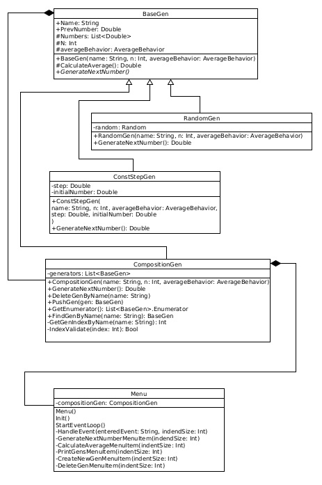

# Лабораторная работа по программированию
<strong>C# - OOP - 1st lab<strong>

# Задание
Реализуйте класс, моделирующий заданный тип объектов предметной области. Сделайте это на основании реализации в директории c_src, написанной на cpp, проведите Code-Review, объясните свои изменения.  

Генераторы последовательностей чисел. Разработать классы СлучайныйГенератор и ГенераторСПостояннымШагом, выдающий следующее число, отличающееся от предыдущего на заданный постоянный шаг. У генераторов должен быть метод СледующееЧисло, а также метод установки предыдущего числа (сброса в это состояние). У каждого объекта классов генераторов должно быть имя в виде текстовой строки. Добавьте каждому генератору метод возврата среднего последних N выданных чисел. N передаётся в конструктор генератора. Если ещё не были сгенерированы хотя бы N чисел, то возможны три варианта поведения: возврат среднего арифметического от сгенерированных чисел, которых меньше N; выброс исключения; возврат NotANumber.
Разработайте класс СоставнойГенератор, выдающий среднее арифметическое чисел, сгенерированных входящими в его состав СлучайнымиГенераторами и ГенераторамиСПостояннымШагом. Реализуйте расчёт среднего арифметического по последним N выданным числам.

## Цели работы

* Научиться анализировать, обновлять и дополнять чужой код
* Познакомиться с языком программирования C#
* Узнать о ранее неизвестных приемах, доступными в C#, например использование анонимных, лямбда -функций , CallBack-ми и др

### Описание классов

class «BaseGen»
Назначение класса и UML-диаграмма 
Базовый класс для всех генераторов, объединяет все общие черты генераторов.

enum «AverageBehaviour»
Назначение перечисления
Перечисление, описывающее поведение генератора при попытке подсчета среднего арифметического, когда сгенерированных чисел недостаточно.

class «ConstStepGen»
Назначение класса и UML-диаграмма 
Генератор с  генерацией чисел методом прибавления какого константного значения.

class «RandomGen»
Назначение класса и UML-диаграмма 
Генератор с  генерацией чисел методом псевдослучайных чисел.

class «CompositionGen»
Назначение класса и UML-диаграмма
Генератор состоящий из вышеперечисленных генераторов. Генерация чисел зависит от имеющихся в нем генераторов и чисел в них.

class «Menu»
Назначение класса и UML-диаграмма
Класс, отвечающий за работу с консолью.

### Описание программы
дерево разбивается на составляющие, которые отрисовываются отдельно
Программа представляет из себя консольное приложение, то есть все взаимодействие пользователя и программы происходит через консоль. При запуске выводится в чем суть приложение и общие понятия, объясняются сущности, с которыми юзер взаимодействует. В дальнейшем создается обязательный композитный генератор, с которым в дальнейшем юзер взаимодействует через меню. 	

